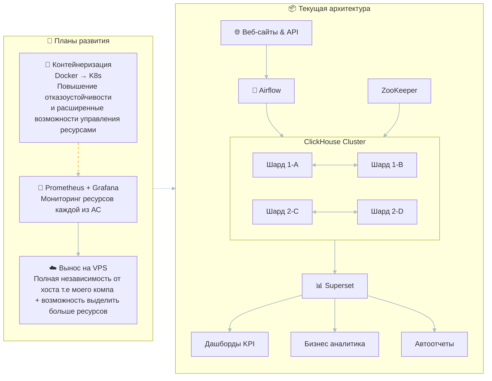

```mermaid
flowchart LR
    %% Блок развития (слева)
    subgraph ROADMAP [🚀 Планы развития]
        direction TB
        H[🐳 Контейнеризация<br/>Docker → K8s<br/>Повышение отказоустойчивости<br/>и расширенные возможности управления ресурсами]
        I[📡 Prometheus + Grafana<br/>Мониторинг ресурсов каждой из АС]
        J[☁️ Вынос на VPS<br/>Полная независимость от хоста т.е моего компа <br/>+ возможность выделить больше ресурсов]
        H --> I --> J
    end

    %% Существующая архитектура (справа)
    subgraph CURRENT [📦 Текущая архитектура]
        direction TB
        A[🌐 Веб-сайты & API] --> B[🔄 Airflow]
        B--> CHCluster
        
        subgraph CHCluster [ClickHouse Cluster]
            direction LR
            C1[Шард 1-A] <--> C2[Шард 1-B]
            C3[Шард 2-C] <--> C4[Шард 2-D]
        end
        
        CHCluster --> D[📊 Superset]
        D --> E[Дашборды KPI]
        D --> F[Бизнес аналитика]
        D --> G[Автоотчеты]
        
        Z[ZooKeeper] --> CHCluster
    end

    %% Связи
    ROADMAP -.-> CURRENT

    %% Стили
    linkStyle default stroke:#b0bec5,stroke-width:1.5px
    linkStyle 0 stroke:#ffb74d,stroke-width:2px,stroke-dasharray:5
```
