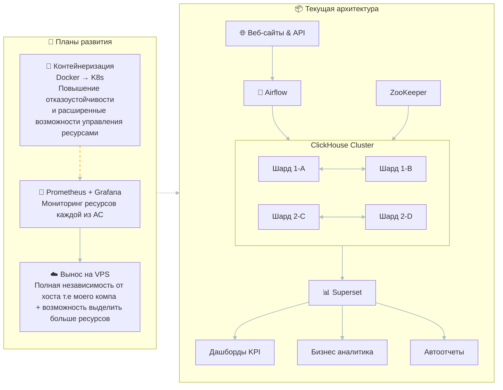

Это мой личный pet-проект, в котором я собрал полноценное Data Warehouse (DWH) решение для анализа объявлений с auto.ru. Проект полностью построен на Open Source технологиях и охватывает весь ETL/ELT-процесс — от парсинга данных до визуализации и автоматической отчетности.

🔄 ETL/ELT процесс
1. Ingestion (Загрузка)
    Airflow DAG парсит API auto.ru по расписанию
    Забирает актуальные объявления о продаже автомобилей
    Данные загружаются в ClickHouse в формате json (сырой слой)

2. Transformation (Трансформация)
    В ClickHouse созданы Materialized Views для:
        Очистки и нормализации данных
        Расчета метрик
        Формирование bi слоя

    Все преобразования происходят внутри БД — быстро и эффективно

3. Serving 
    Apache Superset подключен к ClickHouse

    Построены дашборд с ключевыми KPI:
        Динамика цен
        Топ моделей по ликвидности
        Распределение предложений по регионам

📧 Автоматизация и алертинг

    ✅ Алертинг на новые предложения
        Мониторинг появления свежих объявлений
        Уведомление при обнаружении новых автомобилей на рынке

    ✅ Алертинг на снижение цены
        Отслеживание объявлений, где цена была снижена
        Мгновенное оповещение — не упустить выгодное предложение

    ✅ Ежедневная рассылка дашборда
        Автоматическая отправка на email
        Формат: PNG (также поддерживаются PDF и CSV, но PNG — самый наглядный)
        Приходит готовая "картинка" с ключевыми графиками и таблицами

🚀 Планы развития (Roadmap)

    🐳 Контейнеризация – Docker Compose → Kubernetes
    Повышение отказоустойчивости, упрощение деплоя

    📡 Мониторинг – Prometheus + Grafana
    Отслеживание ресурсов каждой подсистемы (CPU/RAM/диск/сеть)

    ☁️ Вынос на VPS
    Полная независимость от локального ПК + возможность выделить больше ресурсов

💡 Почему проект готов (на данный момент)

    ✅ Закончен полный цикл: API → DWH → BI → Алерты → Рассылка
    ✅ Все компоненты работают стабильно
    ✅ Данные обновляются автоматически
    ✅ Алерты приходят вовремя
    ✅ Отчеты отправляются ежедневно без ручного вмешательства

    📌 Это мой личный sandbox для экспериментов. Проект можно развивать бесконечно, но текущая версия полностью функциональна и решает поставленные задачи.

📬 Контакты

    tg: @Bikmul_24 
    mail: bikmullin24@mail.ru

